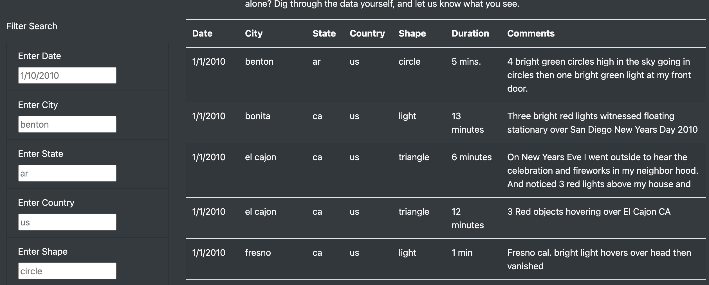
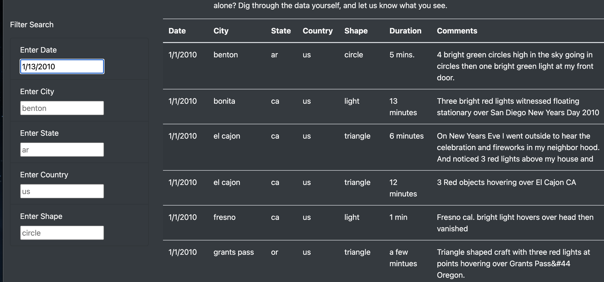
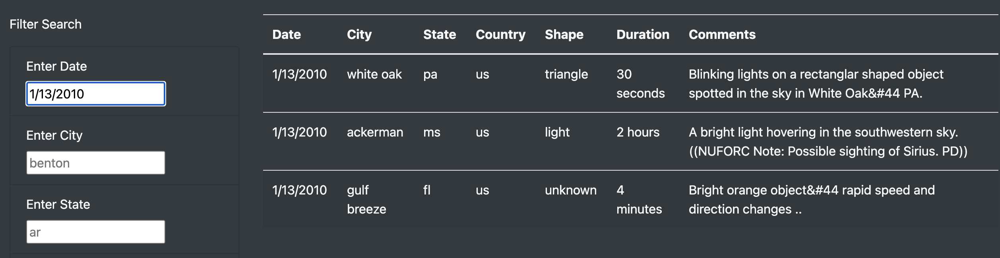

# UFOs

## Purpose 
The purpose of this project is to use html, Javascript (JS), and CSS to put together a website that people can visit to filter through data about UFOs sightings. The vistors can fitler based on city, state, country, and shape of sightings. 

## Results 

### Before filtering data 

 

Vistors will be greated with all data possible before they enter their search filters. They can easily read through the whole table if they so wish, but they have a box of terms to filter by if they want to easily find data specifically. 

### Entering filtering data 

In the example above, one search term is being used, but visitors can use mulitple search terms. To enter search filters, the visitors will click on the box, enter the data, and then hit enter. The table will then filter itself based on that criteria. 

### After entering filtering data 

After hitting enter, the table is filtered and visitors can see relevant data. 

## Summary 

While this website is useful to filter data, one obvious drawback is that there is no way to update the data or to forward new data to the owner of the website. Some suggestions are 1) Create a contact format for visitors to forward new data, 2) create a library of articles that can be filtered based on search terms, and 3) create a form where data can be added to the table by visitors (though this just a suggestion because the data will need to be verified). 
